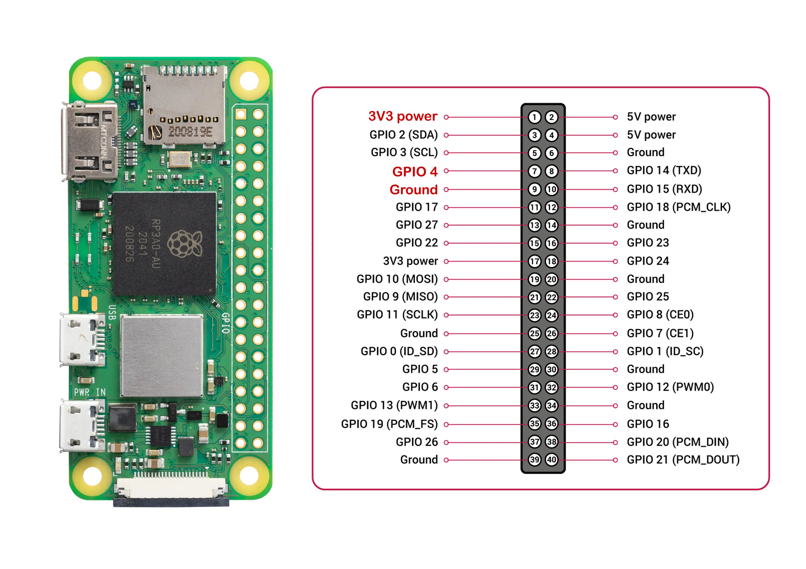

# (Edited) 나만의 스마트 온습도 모니터링 시스템 구축 프로젝트 (2/4)

생성일: December 18, 2024 9:46 AM

스마트홈 시대가 도래하면서 온습도 모니터링 IoT 기기와 관련 서비스들이 넘쳐나고 있습니다. 하지만, 개발자의 관점에서 보면 몇 가지 아쉬운 점이 존재합니다. 대부분의 서비스는 데이터를 1분 또는 1시간 단위로 수집하는데, 이러한 데이터 수집 주기는 정교한 모니터링이 필요한 상황에서는 충분하지 않을 수 있습니다.

이와 같은 문제를 해결하고자 이번 프로젝트를 진행하게 되었습니다. 더욱 세밀한 데이터 수집과 실시간 알림을 통해 스마트홈 환경을 보다 효율적으로 관리해보려고 합니다. 그리고 이를 저희 제품인 와탭을 활용해 구현해보겠습니다.

[1부: 프로젝트 개요 글](https://www.whatap.io/bbs/board.php?bo_table=blog&wr_id=270)을 먼저 읽어보고 오시면 좋습니다. 

# **2부: 하드웨어 구성**

이번 글에서는 라즈베리파이 하드웨어 설정하고 온습도 센서를 연결하여 기본적인 데이터 수집 환경을 구축하고자 합니다. 

# 라즈베리파이 설정

1. 라즈베리파이를 사용하기 위한 첫 단계로 운영체제를 설치하겠습니다. 라즈베리파이 사이트( [https://www.raspberrypi.com/software/](https://www.raspberrypi.com/software/)) 에서 Raspberry Pi Imager 를 다운로드합니다. 라즈베리파이에 사용할 SD 메모리를 PC의 메모리카드 리더기에 연결합니다.


1. Device, OS, Storage(SD 메모리) 를 지정합니다. Raspberry pi zero 2w, Ubuntu Server 24.04.1 LTS 를 사용하였으나, 여건에 따라 다른 구성을 하여도 괜찮습니다. 


1. SD 메모리에 OS를 복사할 때 사전 설정된 환경값을 지정할 수 있습니다. WIFI 설정, 계정 정보를 지정하면 라즈베리파이 설정을 위해 모니터나 키보드를 연결 할 필요가 없습니다. 


1. 모니터를 연결하지 않으려면 필수로 SSH 서비스를 활성화해야 합니다. 
2. 복사가 완료되면, SD메모리를 라즈베리파이의 메모리 슬롯에 끼우고, 전원 ( Micro USB )를 연결합니다.
3. 몇 분의 시간이 경과한 후 WIFI 공유기의 DHCP 목록에서 라즈베리파이를 찾습니다. 

공유기 접속이 어렵다면, Angry IP Scanner([https://angryip.org/](https://angryip.org/))와 같은 도구를 사용하여 22번 포트(SSH)가 활성화 되어 있는 IP를 검색을 통해 라즈베리파이의 IP 를 알아낼 수도 있습니다.

위와 같이 해도 IP 를 알 수 없을 때는 무선랜 접속 오류 등을 확인하기 위하여 HDMI 포트를 모니터와 연결하고, USB 키보드를 연결하여 라즈베리파이 콘솔 화면을 직접 보고 해결할 수 있습니다.

# 온습도 센서 연결

### 라즈베리파이 핀 연결 가이드

%20%E1%84%82%E1%85%A1%E1%84%86%E1%85%A1%E1%86%AB%E1%84%8B%E1%85%B4%20%E1%84%89%E1%85%B3%E1%84%86%E1%85%A1%E1%84%90%E1%85%B3%20%E1%84%8B%E1%85%A9%E1%86%AB%E1%84%89%E1%85%B3%E1%86%B8%E1%84%83%E1%85%A9%20%E1%84%86%E1%85%A9%E1%84%82%E1%85%B5%E1%84%90%E1%85%A5%E1%84%85%E1%85%B5%E1%86%BC%20%E1%84%89%E1%85%B5%E1%84%89%E1%85%B3%E1%84%90%E1%85%A6%E1%86%B7%20bd0a7491a7b64958a3560fa7449c3017/Pinout.jpg)



라즈베리파이에는 40개의 핀으로 구성된 헤더가 있습니다. Zero 시리즈의 경우 핀헤더가 기본적으로 장착되어 있지 않기 때문에 핀헤더의 납땜이 필요합니다. 

납땜이 어려운 분들은 기본 시리즈인 2, 3, 4, 5를 사용하여도 됩니다. 라즈베리파이 제품 시리즈의 핀헤더 배열은 대체로 유사하며, 예를 들어 GPIO 4번 핀의 위치는 Zero 시리즈와 다른 시리즈에서 동일합니다.

- Pin 1 - DC 3.3v
- Pin 7 - GPIO4
- Pin 9 - Ground

위 3개의 핀을 케이블을 통해 센서와 연결합니다.

### 온습도 센서 핀 연결 가이드


DHT22 센서의 경우 핀배열(왼쪽부터)은 아래와 같습니다.

- Pin 1 - VCC (DC 3.3v ~ 5.0v)
- Pin 2 - DATA
- Pin 3 - Not Connected (연결 안 됨)
- Pin 4 - GND

PCB 에 납땜되어 있는 모듈의 경우는 아래와 같습니다.

- Pin 1 - VCC (DC 3.3v ~ 5.0v)
- Pin 2 - DATA
- Pin 3 - GND

PCB에 납땜되어 있는 모듈은 풀업저항(Pull-up Resistor)이 기판에 연결되어 있습니다. 풀업저항은 입력핀을 기본적으로 HIGH(높은 전압)로 유지하여 DATA 선을 통해 전달되는 논리 데이터를 안정적으로 유지하도록 합니다. 일반적으로 4.7kΩ ~ 10kΩ 정도의 저항값을 사용합니다. 온도 센서와 통신중 오류를 줄이기 위해 풀업저항이 있는 모듈을 사용하는 것이 좋습니다.

### 라즈베리파이에 센서 연결


| 라즈베리파이 핀 | 센서핀 (모듈) |
| --- | --- |
| Pin 1 - DC 3.3v | Pin 1 - VCC |
| Pin 7 - GPIO4 | Pin 2 - DATA |
| Pin 9 - Ground | Pin 3 - GND |

위와 같이 3개의 선을 서로 연결하면 하드웨어는 모두 준비가 되었습니다.

### 센서 연결 시 주의사항

- 케이블 길이는 20cm 이내로 유지
- 전원은 반드시 3.3V 사용 (라즈베리파이 gpio 3.3V 레벨과 맞추기 위해)
- 풀업 저항이 있는 모듈 사용 권장

# 개발 환경 구축

### 파이썬 설치

```bash
> ssh gcnam@192.168.0.10
gcnam@pi2w:~$ sudo apt update
gcnam@pi2w:~$ sudo apt upgrade
gcnam@pi2w:~$ python3 --version
Python 3.12.7
gcnam@pi2w:~$ sudo apt install python3-pip
gcnam@pi2w:~$ pip3 --version
pip 24.2 from /usr/lib/python3/dist-packages/pip (python 3.12)
```

ssh 로 라즈베리파이에 접속하고 OS 업데이트 합니다.

### libgpiod 설치

라즈베리파이와 같은 Linux 기반 장치에서 GPIO 핀을 사용하려면 추가로 설치해야 합니다.

```bash
gcnam@pi2w:~$ sudo apt-get install libgpiod-dev
```

### 파이썬 가상환경 설정

```bash
gcnam@pi2w:~$ sudo apt install python3-venv
gcnam@pi2w:~$ python3 -m venv pi
gcnam@pi2w:~$ source pi/bin/activate
(pi) gcnam@pi2w:~$ pip install adafruit-circuitpython-dht
(pi) gcnam@pi2w:~$ pip install RPi.GPIO
```

각 프로젝트마다 서로 다른 라이브러리 버전과 의존성을 독립적으로 관리하기 위해 가상 환경을 사용합니다. 이를 통해 전역 파이썬 환경을 건드리지 않고 프로젝트별로 격리된 환경을 구현할 수 있습니다.

# 데이터 수집 환경 구축

### 기본코드

```python
import adafruit_dht
import board
import time

sensor = adafruit_dht.DHT22(board.D4)

print("Reading data from DHT22 sensor on GPIO4...")

try:
    temperature = sensor.temperature
    humidity = sensor.humidity

    print(f"Temperature: {temperature:.1f}°C, Humidity: {humidity:.1f}%")

except RuntimeError as error:
    print(f"Error reading sensor data: {error}")

finally:
    sensor.exit()
```

python 을 사용하여 DHT22센서의 데이터를 얻어오는 기본 코드를 작성해 봅니다.  adafruit_dht ([https://docs.circuitpython.org/projects/dht/en/latest/](https://docs.circuitpython.org/projects/dht/en/latest/)) 라이브러리를 사용하였으며, 센서 통신 에러가 발생 시 메시지만 출력 하도록 하였습니다.

```bash
(pi) gcnam@pi2w:~$ python3 dht22.py
Reading data from DHT22 sensor on GPIO4...
Temperature: 27.1°C, Humidity: 46.8%
```

### 개선된 최종 코드

실제 운영에 사용할 수 있는 안정적인 코드를 작성합니다.

```python
import adafruit_dht
import board
import time
import json
import os
import sys

def read_dht22_sensor():
    stderr = sys.stderr
    sys.stderr = open(os.devnull, 'w')

    sensor = adafruit_dht.DHT22(board.D4)

    max_attempts = 5
    attempts = 0

    try:
        while attempts < max_attempts:
            try:
                temperature = sensor.temperature
                humidity = sensor.humidity

                sensor_data = {
                    "temperature": round(temperature, 1),
                    "humidity": round(humidity, 1),
                    "result": True
                }

                return sensor_data

            except:
                attempts += 1
                time.sleep(2)

        return {
            "temperature": 0,
            "humidity": 0,
            "result": False
        }

    finally:
        sys.stderr = stderr

        try:
            sensor.exit()
        except:
            pass

def main():
    sensor_data = read_dht22_sensor()
    print(json.dumps(sensor_data, indent=2))

if __name__ == "__main__":
    main()
```

센서로 부터 데이터를 수집하고 결과를 json으로 반환하도록 코드를 작성합니다. 최대 5번의 시도를 하며, 에러메시지는 출력하지 않고 json 데이터에만 오류 유무를 기록합니다.

### 최종 실행 결과

```bash
(pi) gcnam@rpi2:~$ python dht22-json.py
{
  "temperature": 23.5,
  "humidity": 53.0,
  "result": true
}
```

# 문제 해결 가이드

### 1. 라즈베리파이 연결 문제

- WIFI 연결 실패: 이미지 설정에서 입력한 WIFI 정보 재확인
    - 무선랜은 2.4Ghz 대역을 사용
    - WPA/WPA2 보안 사용
- IP 주소 찾기 실패: Angry IP Scanner 사용 또는 모니터 직접 연결

### 2. 센서 관련 문제

- 센서 읽기 오류 발생 시:
    - 케이블 연결 상태 확인
    - 풀업 저항 확인 (4.7kΩ ~ 10kΩ)
    - 케이블 길이 20cm 이내인지 확인
- 불안정한 측정값:
    - 센서 위치가 직사광선이나 열원 근처인지 확인
    - 통신 노이즈 여부 확인

# 마무리

3부에서는 수집한 온습도 데이터를 와탭 모니터링 시스템으로 전송하는 방법을 알아보겠습니다. WhaTap Focus를 설정하고 데이터 전송을 구현하여 WhaTap 대시보드 및 알림을 구성하는 과정을 다룰 예정입니다. 다음 편에서 뵙겠습니다! 

# 참고 자료

- [라즈베리파이 공식 문서](https://www.raspberrypi.com/documentation/computers/raspberry-pi.html)
- [Adafruit CircuitPython DHT 센서 라이브러리 문서](https://docs.circuitpython.org/projects/dht/en/stable/index.html)

# 시리즈 구성

[**1부: 프로젝트 개요**](https://www.whatap.io/bbs/board.php?bo_table=blog&wr_id=270)

- 프로젝트 소개
- 사용할 하드웨어
- 사용할 소프트웨어

**2부: 하드웨어 구성 (이번 글)**

- 라즈베리파이 (Zero 2 W) 설정
- 온습도 센서 (DHT22) 연결
- 데이터 수집 환경 구축

**3부: 와탭 연동**

- WhaTap Focus 설정
- 데이터 전송 구현
- WhaTap 대시보드 및 알림 구성

**4부: 모바일 앱 개발**

- WhaTap Open API 연동
- 실시간 모니터링 앱 구현