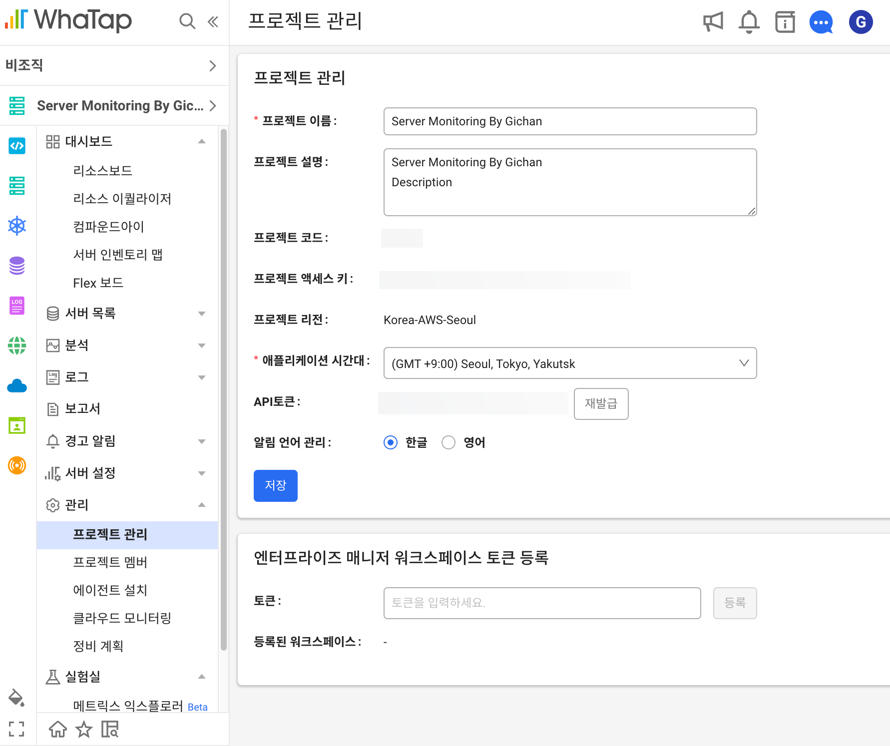
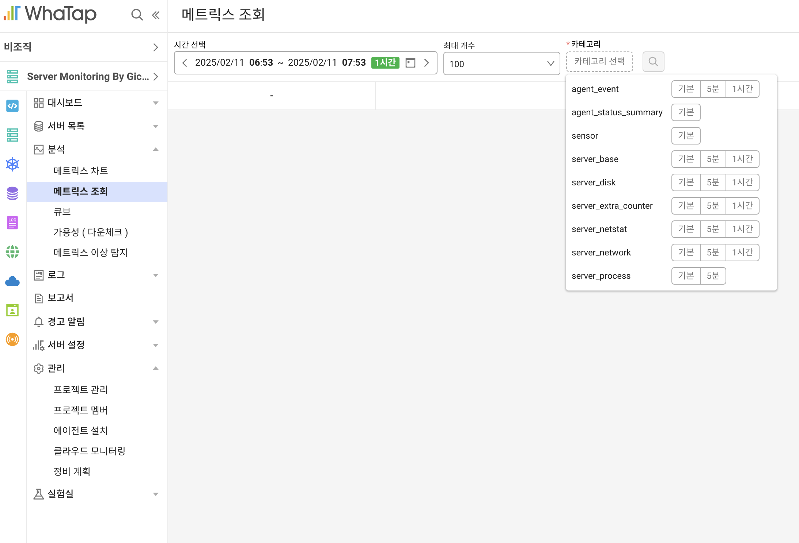
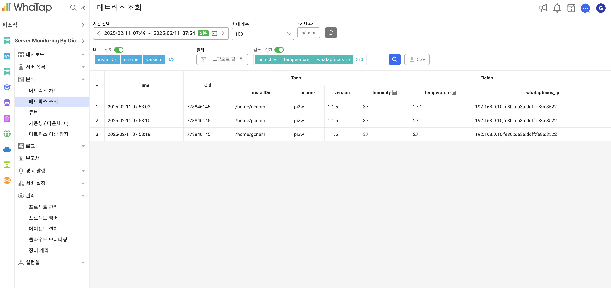
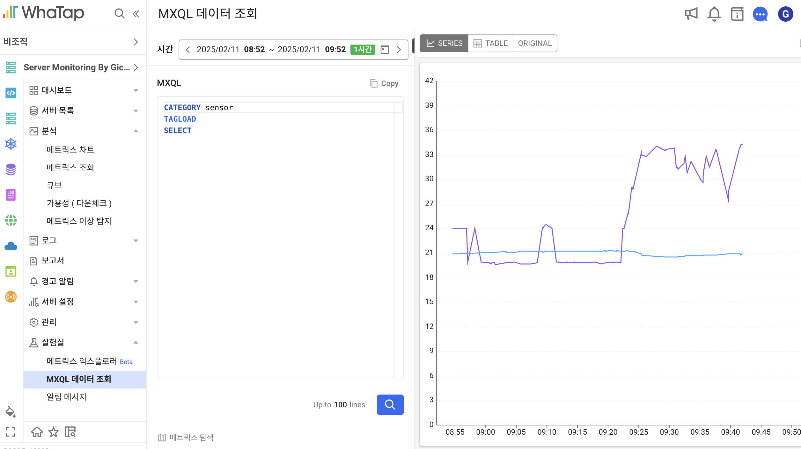
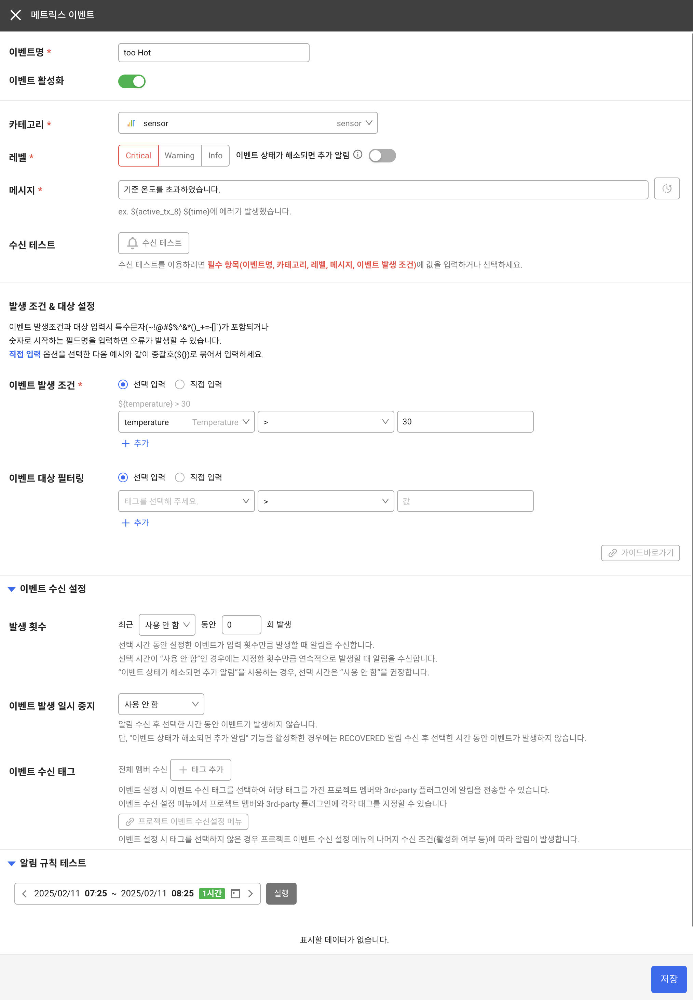

# 나만의 스마트 온습도 모니터링 시스템 구축 프로젝트 (3/4)

발행일: 
작성자: Gichan Nam
카테고리: 와탭모니터링


# **3부: 와탭 연동**

와탭 Focus는 와탭 모니터링 플랫폼에서 커스텀 시계열 데이터를 업로드할 수 있는 프로그램입니다. 자세한 내용은 공식 문서(https://docs.whatap.io/focus/introduction)에서 확인할 수 있습니다. Focus는 다양한 CPU 아키텍처를 지원하며, 라즈베리 파이의 arm64 아키텍처도 지원합니다.


# 와탭 프로젝트 준비 

Focus를 사용하기 위해서는 와탭 계정과 프로젝트가 필요합니다. Focus는 사용자가 정의한 데이터를 메트릭스 형식으로 와탭 프로젝트에 전송할 수 있습니다. 메트릭스 데이터를 지원하는 모든 와탭 프로젝트에서 사용 가능합니다.

와탭은 서버 모니터링 서비스를 5대까지 무료로 제공하고 있어, 유료 사용자가 아니더라도 서버 모니터링 프로젝트로 시작해볼 수 있습니다.




프로젝트 생성 후, 관리 화면에서 프로젝트 액세스 키와 프로젝트 코드를 확인이 가능합니다. 이 두 가지 정보는 라즈베리 파이에서 수집한 데이터를 Focus가 와탭으로 전송하는 데 필요합니다. 와탭 서버 호스트 정보는 에이전트 설치 페이지에서 확인할 수 있습니다.

# WhaTap Focus 설정

와탭 에이전트 저장소 ( https://repo.whatap.io/index.html#focus/ ) 에서 Focus 에이전트를 다운로드 받습니다. Pi2w 는 linux_arm64 아키텍처로 동작하고 있습니다. 

```
(pi) gcnam@pi2w:~$ wget https://repo.whatap.io/focus/linux_arm64/focus
--2025-01-17 11:34:20--  https://repo.whatap.io/focus/linux_arm64/focus
Resolving repo.whatap.io (repo.whatap.io)... 3.168.167.87, 3.168.167.39, 3.168.167.55, ...
Connecting to repo.whatap.io (repo.whatap.io)|3.168.167.87|:443... connected.
HTTP request sent, awaiting response... 200 OK
Length: 35080295 (33M) [binary/octet-stream]
Saving to: ‘focus’

focus                      100%[=====================================>]  33.46M  4.76MB/s    in 7.5s

2025-01-17 11:34:28 (4.46 MB/s) - ‘focus’ saved [35080295/35080295]

(pi) gcnam@pi2w:~$ chmod +x focus
```

wget 명령어를 사용하여 라즈베리 파이 내부에 다운로드하고 실행 권한을 부여 합니다. 

```
(pi) gcnam@pi2w:~$ ./focus

    ______                WHATAP
   / ____/___  _______  _______
  / /_  / __ \/ ___/ / / / ___/
 / __/ / /_/ / /__/ /_/ (__  )
/_/    \____/\___/\__,_/____/

 WhaTap Focus ver 1.1.5
 Copyright ⓒ 2019 WhaTap Labs Inc. All rights reserved.

2025/01/17 11:35:46 [error] no project code[-pcode]

usage: focus   -pcode <pcode>    : project code
               -license <license>  : project access key
               -category <category>  : category name
               -server.host <server-address>  : whatap server proxy ips
               -oname <oname>  :[opt] agent name
               -okind <okind>  :[opt] server kind name
               -onode <onode>  :[opt] server node name
               -server.port 6600  :[opt] whatap server port(default:6600)
               -tag.<tagname>  <tagvalue>  :[opt] additional tag
               -pk <fieldname>  :[opt] primary key field
               -debug  :[opt] debug on
---- stdin-json ----
               -onetime  :[opt] one time stdin-json mode
---- sys mon ----
               -print:nic : print network interface cards(nic)
               -sys  : enable sys mon
               -sys.disk.enabled true :[opt] enable disk mon
               -sys.disk / :[opt] set disk path
               -sys.net.enabled true :[opt] enable net mon
               -sys.net en0 :[opt] set net nic
---- tail log ----
               -tail <filepath> : tail fullpath
               -tail.block 4000000 :[opt] max block size
               -tail.linemin 10 : minum line length
               -tail.linestart ""  :[opt]indecate line start str
               -tail.keys <word,word,...> :[opt] log keys
               -tail.ignores <word,word,...> :[opt] log ignore keys, not send
               -tail.throttle 100 :[opt] not allowed sending logs over the count(default:100)
---- logsink ----
               -logsink <filepath> : logsink fullpath
               -logsink.seperator <separator> :[opt] filepath separator(default ,)

(pi) gcnam@pi2w:~$
```

Focus 에서 지원하는 명령어는 위와 같습니다.

사용자 데이터를 전송하기 위해서는 license, pcode, category, onetime 옵션을 전달해야 합니다.

```
echo '{"temperature": 27.1, "humidity": 37.0}' |        // 사용자 JSON 데이터
./focus 
-license x479s23j7it9r-*************-z4dan9rfga5htf     // 프로젝트 라이센스
-pcode 7*****                                           // 프로젝트 코드
-server.host 13.124.*.*                                 // 와탭 서버 호스트
-category sensor                                        // 카테고리
-onetime                                                // JSON OneTime 전송
```


```
(pi) gcnam@pi2w:~$ echo '{"temperature": 27.1, "humidity": 37.0}' | ./focus -license x479s23j7it9r-*************-z4dan9rfga5htf     -pcode 7***** -server.host 13.124.*.*     -category sensor -onetime

    ______                WHATAP
   / ____/___  _______  _______
  / /_  / __ \/ ___/ / / / ___/
 / __/ / /_/ / /__/ /_/ (__  )
/_/    \____/\___/\__,_/____/

 WhaTap Focus ver 1.1.5
 Copyright ⓒ 2019 WhaTap Labs Inc. All rights reserved.

 Collecting stdin-json
2025/01/17 11:36:59 [TCP] Connected 13.124.*.*:6600
2025/01/17 11:36:59 [TCP] Closed 13.124.*.*:6600
```

가상의 데이터를 Focus를 통하여 전송해 봅니다. 

# 메트릭스 기능 소개


메트릭스 조회 화면에 지정한 sensor 카테고리가 생성된 것을 확인할 수 있습니다. 


해당 시간에 조회를 해보면 반복 전송한 원본 데이터가 조회 됩니다. 


MXQL 데이터 조회를 사용하면 시리즈 차트로 구성해서 미리 보기 할 수 있습니다. 


와탭은 수집된 메트릭스 데이터에 대해 알람을 설정할 수 있습니다. 예를 들어 온도가 30도를 초과하면, 이메일, 모바일 앱 푸시, SMS, 또는 서드파티 플러그인을 통해 알림을 받을 수 있습니다.

# 실제 데이터 수집 전송 

라즈베리파이에 연결된 온습도 센서에서 수집한 데이터를 Focus 를 통하여 와탭으로 전송하는 코드를 작성합니다.
## dht22-focus.py

```
import adafruit_dht
import board
import time
import json
import os
import sys
import subprocess
import logging
from datetime import datetime

# 로깅 설정
def setup_logging():
    log_dir = 'logs'
    if not os.path.exists(log_dir):
        os.makedirs(log_dir)

    logging.basicConfig(
        level=logging.INFO,
        format='%(asctime)s - %(levelname)s - %(message)s',
        handlers=[
            logging.FileHandler(
                os.path.join(log_dir, f'sensor_{datetime.now().strftime("%Y%m%d")}.log')
            ),
            logging.StreamHandler(sys.stderr)
        ]
    )
    return logging.getLogger(__name__)

def read_dht22_sensor():
    stderr = sys.stderr
    sys.stderr = open(os.devnull, 'w')
    sensor = adafruit_dht.DHT22(board.D4)
    max_attempts = 10
    attempts = 0

    try:
        while attempts < max_attempts:
            try:
                temperature = sensor.temperature
                humidity = sensor.humidity

                # 센서 데이터 유효성 검사
                if not (isinstance(temperature, (int, float)) and isinstance(humidity, (int, float))):
                    raise ValueError("Invalid sensor data types")
                if not (-40 <= temperature <= 80 and 0 <= humidity <= 100):
                    raise ValueError("Sensor values out of valid range")

                return {
                    "temperature": round(temperature, 1),
                    "humidity": round(humidity, 1),
                    "result": True
                }
            except Exception as e:
                attempts += 1
                if attempts < max_attempts:
                    time.sleep(2)
                continue

        return {
            "temperature": 0,
            "humidity": 0,
            "result": False
        }
    finally:
        sys.stderr = stderr
        try:
            sensor.exit()
        except:
            pass

def send_to_focus(data, logger):
    try:
        # result 키 제거 및 JSON 문자열 생성
        send_data = {k: v for k, v in data.items() if k != 'result'}
        json_str = json.dumps(send_data)

        # focus 명령어 구성
        focus_cmd = [
            'echo',
            json_str,
            '|',
            './focus',
            '-license', 'x479s23j7it9r-*************-z4dan9rfga5htf',
            '-pcode', '7*****',
            '-server.host', '13.124.*.*',
            '-category', 'sensor',
            '-onetime'
        ]

        # 명령어 실행
        cmd = ' '.join(focus_cmd)
        result = subprocess.run(cmd, shell=True, capture_output=True, text=True)

        if result.returncode == 0:
            logger.info(f"Data sent successfully: {json_str}")
            return True
        else:
            logger.error(f"Focus command failed: {result.stderr}")
            return False

    except Exception as e:
        logger.error(f"Error sending data: {str(e)}")
        return False

def main():
    logger = setup_logging()
    logger.info("Starting DHT22 sensor monitoring")

    # 종료 핸들링을 위한 플래그
    running = True

    try:
        while running:
            try:
                # 센서 데이터 읽기
                sensor_data = read_dht22_sensor()

                # 유효한 데이터인 경우에만 전송
                if sensor_data["result"]:
                    success = send_to_focus(sensor_data, logger)
                    if not success:
                        logger.warning("Failed to send data, will retry in next iteration")
                else:
                    logger.warning("Failed to read sensor data")

                # 다음 읽기까지 대기
                time.sleep(2)

            except KeyboardInterrupt:
                logger.info("Program terminated by user")
                running = False
            except Exception as e:
                logger.error(f"Unexpected error in main loop: {str(e)}")
                time.sleep(2)  # 오류 발생 시 잠시 대기 후 재시도

    except Exception as e:
        logger.critical(f"Critical error in main program: {str(e)}")
    finally:
        logger.info("Program terminated")

if __name__ == "__main__":
    main()

```

## 코드 실행

```
(pi) gcnam@pi2w:~$ python3 dht22-focus.py
2025-02-11 08:33:50,560 - INFO - Starting DHT22 sensor monitoring
2025-02-11 08:33:58,128 - INFO - Data sent successfully: {"temperature": 20.5, "humidity": 24.5}
2025-02-11 08:34:03,042 - INFO - Data sent successfully: {"temperature": 20.6, "humidity": 24.4}
2025-02-11 08:34:10,311 - INFO - Data sent successfully: {"temperature": 20.6, "humidity": 24.4}
2025-02-11 08:34:22,149 - INFO - Data sent successfully: {"temperature": 20.6, "humidity": 24.4}
2025-02-11 08:34:45,028 - WARNING - Failed to read sensor data
```

라즈베리파이를 활용한 주기적 데이터 전송 시스템을 구현하였습니다. 이번에 작성한 글에서는 아날로그 센서(DHT22)를 사용하였는데,  아날로그 센서는 특성상 오류가 빈번하게 발생할 수 있어 오류 검출 로직을 추가하였습니다. 만약 비용제약이 없다면, I2C 통신이 가능한 디지털 센서를 활용하여 보다 안정적인 시스템을 구축할 수 있습니다.

현재 공유된 코드는 기본적인 기능 구현에 초점을 맞춘 예제 코드입니다. 실제 서비스 단계에서는 시스템 안정화, 상태 모니터링, 환경 변수 분리 등 추가적인 보완이 필요합니다.

코드는 https://github.com/gichan7/mindscape 저장소에서도 확인 할수 있습니다.

# 마무리

라즈베리파이에서 수집 온습도 데이터를 와탭으로 전송하여 데이터를 저장하고 시각화하는 과정을 살펴 보았습니다. 4부 : 모바일 앱 개발 편에서는 와탭에 저장된 데이터를 Open API 를 통해 조회하고 간단한 모바일 앱을 통하여 실시간으로 보여주는 예제를 만들어 볼 예정입니다.
