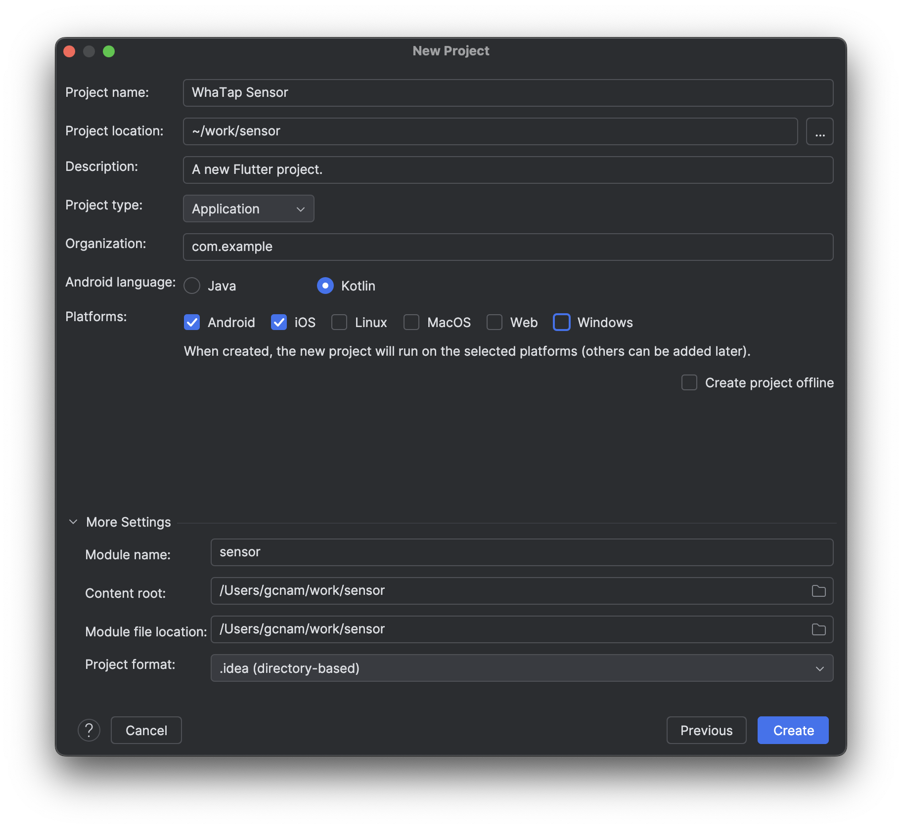
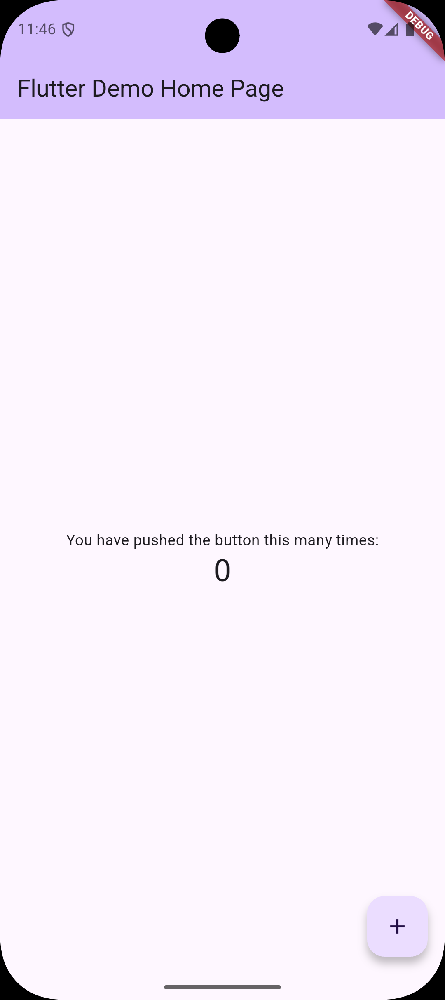
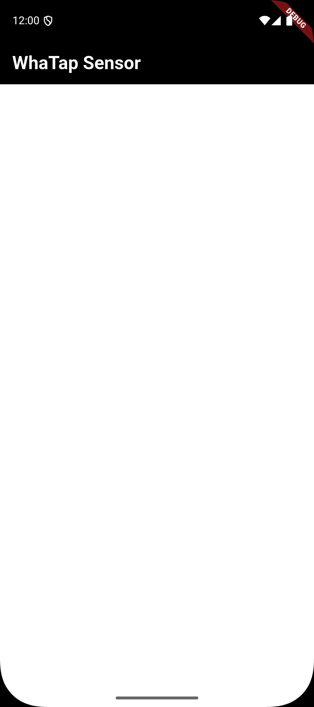
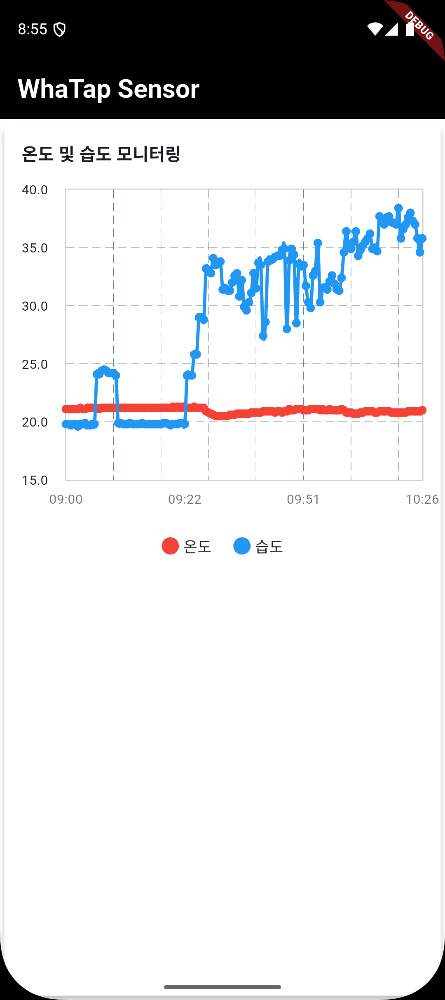

# 나만의 스마트 온습도 모니터링 시스템 구축 프로젝트 (4/4)

발행일: 
작성자: Gichan Nam
카테고리: 와탭모니터링


# **4부: 모바일 앱 개발**

이전 회차에서는 라즈베리파이의 온습도 센서 데이터를 와탭 프로젝트에 저장하는 방법을 알아보았습니다. 이번에는 와탭의 Open API를 활용하여 저장된 데이터를 조회하고, Flutter를 사용해 모바일 앱에서 시각화하는 방법을 살펴보겠습니다. 개발 환경으로는 Android 시뮬레이터를 사용할 예정입니다.

# 준비물

## Open API 
와탭 Open API를 사용하기 위해서는 다음 세 가지 정보가 필요합니다:
* 프로젝트 API 토큰
* 프로젝트 코드

자세한 설정 방법은 와탭 공식 문서(https://docs.whatap.io/openapi-spec)를 참고하시기 바랍니다.

## MXQL
MXQL은 와탭의 성능 데이터(메트릭스)를 조회하기 위한 와탭의 전용 쿼리 언어입니다. 3부에서 살펴본 것처럼, MXQL을 사용하면 수집된 데이터를 차트로 시각화할 수 있습니다.

```
CATEGORY sensor
TAGLOAD
SELECT
```

위의 예제와 같이 저장된 데이터를 단순 조회 할 수 있습니다. 

## MXQL Open API
Open API 를 통하여 MXQL을 호출하고 결과를 수신 할 수 있습니다. 
https://docs.whatap.io/openapi-spec#tag/MXQL-Open-API

# MXQL Open API 테스트 
준비된 정보를 가지고 데이터를 조회해 보는 테스트를 진행합니다. 

* x-whatap-token : 프로젝트 API Key
* x-whatap-pcode : 프로젝트 ID
* stime : 조회 시작 시간(UNIX epoch time, millisecond)
* etime : 조회 종료 시간(UNIX epoch time, millisecond)

```bash
curl -X "POST" "https://api.whatap.io/open/api/flush/mxql/text" \
-H 'x-whatap-token: BO20****************FPHH' \
-H 'x-whatap-pcode: 10***' \
-H 'Content-Type: application/json; charset=utf-8' \
-d $'{
"mql": "CATEGORY sensor\\nTAGLOAD\\nSELECT",
"stime": 1738720860000,
"etime": 1739325660000,
"pageKey": "mxql",
"limit": 3
}'
```
최근 7일간 데이터를 3개 제한으로 조회합니다. 

```json
[
  {
    "time": 1739227982000,
    "pcode": 10***,
    "pname": "Server Monitoring By Gichan",
    "installDir": "/home/gcnam",
    "version": "1.1.5",
    "oname": "pi2w",
    "whatapfocus_ip": "192.168.0.10,fe80::da3a:ddff:fe8a:8522",
    "temperature": 27.1,
    "humidity": 37,
    "oid": 778846145
  },
  {
    "time": 1739227990000,
    "pcode": 10***,
    "pname": "Server Monitoring By Gichan",
    "installDir": "/home/gcnam",
    "version": "1.1.5",
    "oname": "pi2w",
    "whatapfocus_ip": "192.168.0.10,fe80::da3a:ddff:fe8a:8522",
    "temperature": 27.1,
    "humidity": 37,
    "oid": 778846145
  },
  {
    "time": 1739227998000,
    "pcode": 10***,
    "pname": "Server Monitoring By Gichan",
    "installDir": "/home/gcnam",
    "version": "1.1.5",
    "oname": "pi2w",
    "whatapfocus_ip": "192.168.0.10,fe80::da3a:ddff:fe8a:8522",
    "temperature": 27.1,
    "humidity": 37,
    "oid": 778846145
  }
]
```
결과는 위와 같습니다. 

# 모바일 앱 개발 

## Flutter 
Flutter는 구글이 개발한 크로스 플랫폼 프레임워크입니다. 단일 코드베이스로 iOS와 Android 앱을 모두 개발할 수 있어 효율적입니다. 특징은 다음과 같습니다:

* 다트(Dart) 프로그래밍 언어 사용
* 풍부한 내장 위젯으로 빠른 UI 개발 가능
* 핫 리로드 기능으로 실시간 코드 수정 및 확인 가능
* 네이티브 수준의 높은 성능 제공

## 도구
Flutter 개발을 위해 다음 도구들을 설치해야 합니다:

1. Flutter SDK: 개발 PC의 운영체제에 맞는 버전 설치
2. Android Studio: 공식 Android IDE
3. Android Studio 플러그인:
 * Dart 플러그인
 * Flutter 플러그인

자세한 설치 방법은 Flutter 공식 웹사이트(https://flutter.dev/)의 가이드를 참고하시기 바랍니다.

## 프로젝트 생성


## 빈 프로젝트를 안드로이드로 실행 

Android Studio에서 새로운 Flutter 프로젝트를 생성하면 기본적으로 카운터 앱 예제가 포함됩니다. 이 예제 코드는 lib/main.dart 파일에서 확인할 수 있습니다.

## 라이브러리 설치
```
dependencies:  
  flutter:  
    sdk: flutter  
  
  # The following adds the Cupertino Icons font to your application.  
  # Use with the CupertinoIcons class for iOS style icons.  cupertino_icons: ^1.0.8  
  dio: ^5.4.0  
  fl_chart: ^0.66.0
```
프로젝트에 필요한 주요 라이브러리는 다음과 같습니다:

* Dio: HTTP 통신을 위한 강력한 라이브러리
* fl_chart: 데이터 시각화를 위한 차트 라이브러리

이 두 라이브러리를 사용하여 와탭의 API를 호출하고 온습도 데이터를 차트로 표시하겠습니다.

## main.dart 화면 정리
```dart 
import 'package:flutter/material.dart';  
  
void main() {  
  runApp(const MyApp());  
}  
  
class MyApp extends StatelessWidget {  
  const MyApp({super.key});  
  
  @override  
  Widget build(BuildContext context) {  
    return const MaterialApp(  
      home: WhiteScreen(),  
    );  
  }  
}  
  
class WhiteScreen extends StatelessWidget {  
  const WhiteScreen({super.key});  
  
  @override  
  Widget build(BuildContext context) {  
    return Scaffold(  
      appBar: AppBar(  
        title: Text(  
          'WhaTap Sensor',  
          style: TextStyle(  
            color: Colors.white,  
            fontSize: 24,  
            fontWeight: FontWeight.bold,  
          ),  
        ),  
        backgroundColor: Colors.black,  
      ),  
      backgroundColor: Colors.white,  
    );  
  }  
}
```
lib/main.dart 를 간결하게 정리합니다.



## Open API 테스트 코드 작성

```dart
import 'package:dio/dio.dart';  
  
class WhatapOpenApi {  
  final Dio _dio = Dio();  
  final String baseUrl = 'https://api.whatap.io/open/api';  
    
  // API 인증 정보  
  final String token;  
  final String pcode;  
  
  WhatapOpenApi({  
    required this.token,  
    required this.pcode,  
  }) {  
    _dio.options.headers = {  
      'x-whatap-token': token,  
      'x-whatap-pcode': pcode,  
      'Content-Type': 'application/json; charset=utf-8',  
    };  
  }  
  
  /// MQL 쿼리를 실행하여 데이터를 조회합니다.  
  Future<dynamic> executeMql({  
    required String mql,  
    required int startTime,  
    required int endTime,  
    String pageKey = 'mxql',  
    int limit = 3,  
  }) async {  
    try {  
      final response = await _dio.post(  
        '$baseUrl/flush/mxql/text',  
        data: {  
          'mql': mql,  
          'stime': startTime,  
          'etime': endTime,  
          'pageKey': pageKey,  
          'limit': limit,  
        },  
      );  
        
      return response.data;  
    } on DioException catch (e) {  
      throw _handleDioError(e);  
    }  
  }  
  
  /// Dio 에러를 처리하는 헬퍼 메서드  
  Exception _handleDioError(DioException e) {  
    switch (e.type) {  
      case DioExceptionType.connectionTimeout:  
      case DioExceptionType.sendTimeout:  
      case DioExceptionType.receiveTimeout:  
        return Exception('연결 시간이 초과되었습니다.');  
      case DioExceptionType.badResponse:  
        return Exception('서버 오류: ${e.response?.statusCode}');  
      case DioExceptionType.cancel:  
        return Exception('요청이 취소되었습니다.');  
      default:  
        return Exception('네트워크 오류가 발생했습니다: ${e.message}');  
    }  
  }  
}
```
와탭 Open API 통신 코드를 작성합니다. 

```dart
  void apiTest() async {
    final api = WhatapOpenApi(
      token: kToken,
      pcode: kPcode,
    );

    try {
      final result = await api.executeMql(
        mql: kMql,
        startTime: kStartTime,
        endTime: kEndTime,
      );
      if (kDebugMode) {
        print(result);
      }
    } catch (e) {
      if (kDebugMode) {
        print('Error: $e');
      }
    }
  }
```
와탭 Open API 테스트 코드를 작성합니다. 

```
I/flutter ( 3963): [{time: 1739232034000, pcode: 10***, pname: Server Monitoring By Gichan, installDir: /home/gcnam, version: 1.1.5, oname: pi2w, whatapfocus_ip: 192.168.0.10,fe80::da3a:ddff:fe8a:8522, temperature: 21.1, humidity: 19.8, oid: 778846145}, {time: 1739232041000, pcode: 10***, pname: Server Monitoring By Gichan, installDir: /home/gcnam, version: 1.1.5, oname: pi2w, whatapfocus_ip: 192.168.0.10,fe80::da3a:ddff:fe8a:8522, temperature: 21.1, humidity: 19.8, oid: 778846145}, {time: 1739232046000, pcode: 10***, pname: Server Monitoring By Gichan, installDir: /home/gcnam, version: 1.1.5, oname: pi2w, whatapfocus_ip: 192.168.0.10,fe80::da3a:ddff:fe8a:8522, humidity: 19.7, temperature: 21.1, oid: 778846145}]
```
AndroidStudio 콘솔에 수신한 데이터가 정상 출력되는 것을 확인합니다. 

## 실제 동작 코드 수정

```dart
import 'dart:convert';  
  
class SensorData {  
  final int time;  
  final double temperature;  
  final double humidity;  
  
  SensorData({  
    required this.time,  
    required this.temperature,  
    required this.humidity,  
  });  
  
  factory SensorData.fromJson(String str) => SensorData.fromMap(json.decode(str));  
  
  String toJson() => json.encode(toMap());  
  
  factory SensorData.fromMap(Map<String, dynamic> json) => SensorData(  
    time: json["time"],  
    temperature: json["temperature"]?.toDouble(),  
    humidity: json["humidity"]?.toDouble(),  
  );  
  
  static List<SensorData> listFromMap(List<dynamic> list) =>  
      list.map((e) => SensorData.fromMap(e as Map<String, dynamic>)).toList();  
  
  Map<String, dynamic> toMap() => {  
    "time": time,  
    "temperature": temperature,  
    "humidity": humidity,  
  };  
}
```
데이터 모델 클래스를 작성합니다. 

```dart
@override  
Widget build(BuildContext context) {  
  return FutureBuilder<dynamic>(  
    future: getDataFromAPI(),  
    builder: (context, snapshot) {  
      if (snapshot.connectionState == ConnectionState.waiting) {  
        return const Center(child: CircularProgressIndicator());  
      }  
  
      if (snapshot.hasError) {  
        return Center(child: Text('Error: ${snapshot.error}'));  
      }  
  
      if (!snapshot.hasData) {  
        return const Center(child: Text('No data available'));  
      }  
  
      final List<SensorData> sensorData =  
          SensorData.listFromMap(snapshot.data as List<dynamic>);  
  
      return Card(  
        elevation: 4,  
        shape: RoundedRectangleBorder(borderRadius: BorderRadius.circular(8)),  
        color: Colors.white,  
        child: Padding(  
          padding: const EdgeInsets.all(16),  
          child: Column(  
            crossAxisAlignment: CrossAxisAlignment.start,  
            children: [  
              const Text(  
                '온도 및 습도 모니터링',  
                style: TextStyle(  
                  fontSize: 16,  
                  fontWeight: FontWeight.bold,  
                ),  
              ),  
              const SizedBox(height: 20),  
              SizedBox(  
                height: 300,  
                child: LineChart(  
                  LineChartData(  
                    lineTouchData: LineTouchData(  
                      touchTooltipData: LineTouchTooltipData(  
                        tooltipBgColor: Colors.blueGrey.withOpacity(0.8),  
                      ),  
                      handleBuiltInTouches: true,  
                    ),  
                    gridData: FlGridData(  
                      show: true,  
                      drawVerticalLine: true,  
                    ),  
                    titlesData: FlTitlesData(  
                      bottomTitles: AxisTitles(  
                        sideTitles: SideTitles(  
                          showTitles: true,  
                          reservedSize: 30,  
                          getTitlesWidget: (value, meta) {  
                            int index = value.toInt();  
                            if (index < 0 || index >= sensorData.length) {  
                              return Container();  
                            }  
                            if (index % 50 != 0) return Container();  
  
                            final time = DateTime.fromMillisecondsSinceEpoch(  
                                sensorData[index].time);  
                            String formattedTime =  
                                '${time.hour.toString().padLeft(2, '0')}:${time.minute.toString().padLeft(2, '0')}';  
                            return Padding(  
                              padding: const EdgeInsets.all(8.0),  
                              child: Text(  
                                formattedTime,  
                                style: const TextStyle(  
                                  fontSize: 12,  
                                  color: Colors.black54,  
                                ),  
                              ),  
                            );  
                          },  
                          interval: 1,  
                        ),  
                      ),  
                      leftTitles: AxisTitles(  
                        sideTitles: SideTitles(  
                          showTitles: true,  
                          reservedSize: 40,  
                          getTitlesWidget: (value, meta) {  
                            return Text(  
                              value.toStringAsFixed(1),  
                              style: const TextStyle(fontSize: 12),  
                            );  
                          },  
                        ),  
                      ),  
                      rightTitles: AxisTitles(  
                        sideTitles: SideTitles(showTitles: false),  
                      ),  
                      topTitles: AxisTitles(  
                        sideTitles: SideTitles(showTitles: false),  
                      ),  
                    ),  
                    borderData: FlBorderData(  
                      show: true,  
                      border: Border.all(color: Colors.grey.withOpacity(0.5)),  
                    ),  
                    minX: 0,  
                    maxX: (sensorData.length - 1).toDouble(),  
                    minY: 15,  
                    // 최소값 설정  
                    maxY: 40,  
                    // 최대값 설정  
                    lineBarsData: [  
                      // 온도 라인  
                      LineChartBarData(  
                        spots: List.generate(  
                          sensorData.length,  
                          (index) => FlSpot(  
                            index.toDouble(),  
                            sensorData[index].temperature,  
                          ),  
                        ),  
                        isCurved: true,  
                        color: Colors.red,  
                        barWidth: 3,  
                        dotData: FlDotData(show: true),  
                      ),  
                      // 습도 라인  
                      LineChartBarData(  
                        spots: List.generate(  
                          sensorData.length,  
                          (index) => FlSpot(  
                            index.toDouble(),  
                            sensorData[index].humidity,  
                          ),  
                        ),  
                        isCurved: true,  
                        color: Colors.blue,  
                        barWidth: 3,  
                        dotData: FlDotData(show: true),  
                      ),  
                    ],  
                  ),  
                ),  
              ),  
              const SizedBox(height: 20),  
              Row(  
                mainAxisAlignment: MainAxisAlignment.center,  
                children: [  
                  _buildLegend('온도', Colors.red),  
                  const SizedBox(width: 20),  
                  _buildLegend('습도', Colors.blue),  
                ],  
              ),  
            ],  
          ),  
        ),  
      );  
    },  
  );  
}
```
차트가 표시되는 UI 화면을 수정합니다. 



## 마무리 
이번 프로젝트에서는 IoT 디바이스의 데이터를 와탭에 저장하고 모바일 앱으로 시각화하는 전체 과정을 살펴보았습니다. 현재 구성은 기본적인 데모를 위한 것으로, 실제 활용을 위해서는 다음과 같은 기능을 추가로 고려해볼 수 있습니다:
* 시간/날짜 범위 선택
* 데이터 필터링
* 상세 분석 도구
이 프로젝트의 전체 소스 코드는 GitHub 저장소(https://github.com/gichan7/mindscape)에서 확인하실 수 있습니다.

와탭은 사용자 데이터 저장, 알림 설정, Open API를 통한 데이터 조회 등 다양한 기능을 제공합니다. 이러한 기능들을 활용하면 기존의 서버 모니터링, APM 솔루션과 연계하여 더욱 포괄적인 모니터링 시스템을 구축할 수 있습니다.